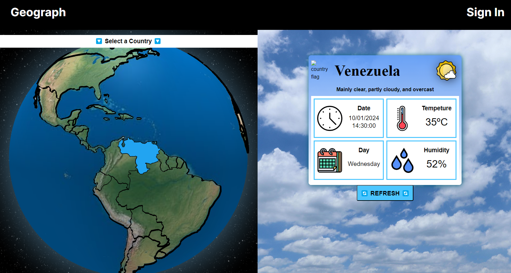
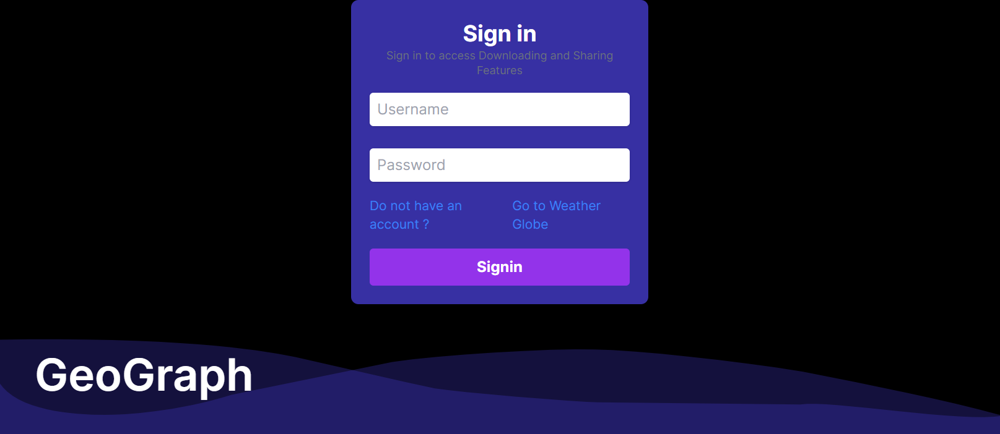
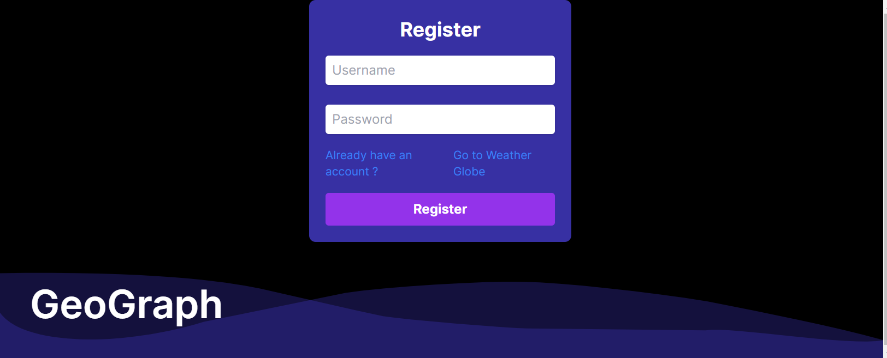
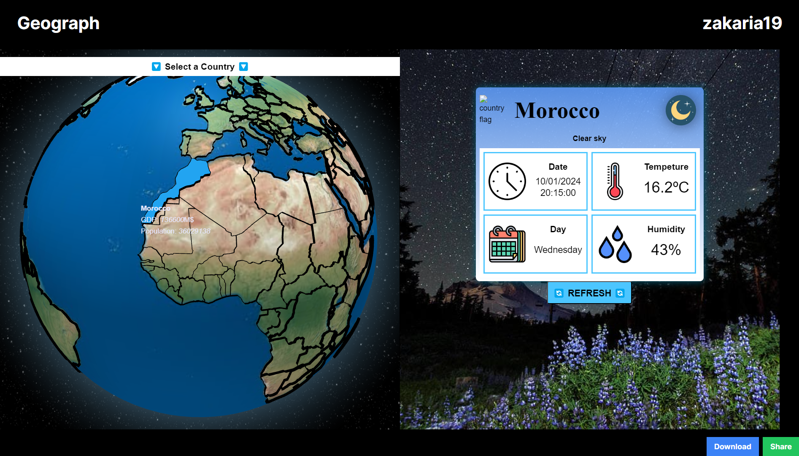
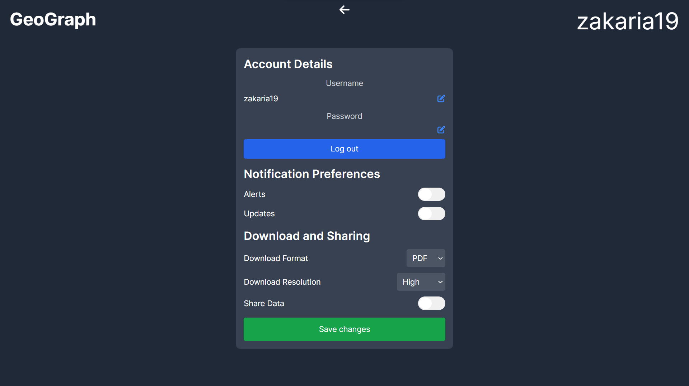

# Geograph

## Table of Contents

- [Geograph](#geograph)
  - [Table of Contents](#table-of-contents)
  - [Overview](#overview)
    - [Features](#features)
  - [Technologies Used](#technologies-used)
    - [Open Source Projects Used](#open-source-projects-used)
  - [Visuals](#visuals)
  - [Account Settings](#account-settings)
  
## Overview
Geograph is a web application designed to explore countries across the globe seamlessly. It provides detailed information about different countries, including their population, GDP, weather conditions, and more. Users can navigate a globe map, interactively select countries, and retrieve various data points effortlessly.

### Features
- **User Authentication:** Secure log in and log out functionality for personalized experiences.
- **Globe Exploration:** Navigate the globe to explore different countries and retrieve specific details.
- **Country Information:** Access country-specific information such as population, GDP and more.
- **Real-time Weather:** Check the current weather conditions of selected countries.
- **Date and Temperature:** Retrieve the current date, temperature, day, and humidity of the chosen country.
- **Refresh:** Refresh to update the data
- **Data Download:** Access additional functionalities like data download after logging in.

## Technologies Used
- **HTML/CSS (Sass)**
- **JavaScript (React):** Utilized for frontend development.
- **Next.js:** Employed for backend development.
- **Three.js:** Employed for interactive globe visualization.
- **Third-Party Software:** Leveraged various open-source projects to enhance functionality.

### Open Source Projects Used
> **[Globe.gl](https://github.com/vasturiano/globe.gl):** A web component to represent data visualization layers on a 3-dimensional globe in a spherical projection.

> **[Geojson.xyz](https://geojson.xyz/):** Website and utility for fast access to GeoJSON data for web mapping.

> **[Weather API - Open-Meteo](https://open-meteo.com/):** Open-source weather API offering free access for non-commercial use based on latitude and longitude.

## Visuals

- **Globe Exploration:** 

- **Login Page:** 

  
- **Country Details and Weather Display:** 

## Account Settings

- **Settings Page:** Users can manage their account settings, change passwords, log out, and customize preferences.

  
